````markdown
# Survival Game

A 2D side-scrolling platformer developed with Python and Pygame.

The game features five levels, unique environments, enemies, boss battles, unlockable abilities, checkpoints, and a separate Survival Mode where you fight through endless waves of enemies.

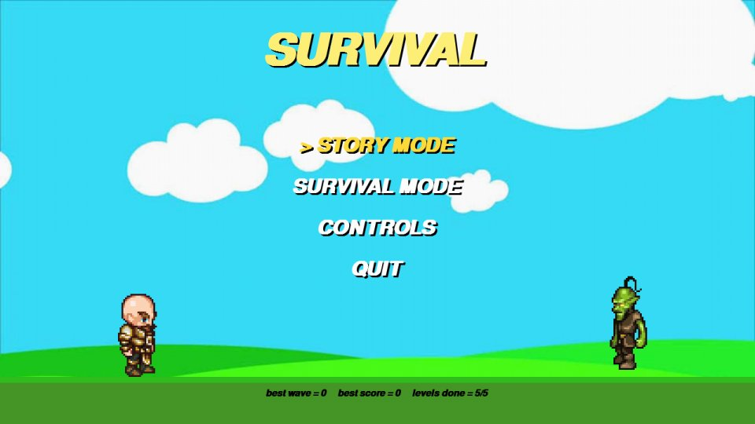

## Running the Game

You need:

- Python 3
- Pygame 2

Install the required dependencies:

```bash
pip install -r requirements.txt
````

Run the game:

```bash
python servaivle.py
```

Run the game from inside the project folder because the images and sounds are loaded using relative paths.

The game saves your progress in `save.json` next to the main script. Deleting this file will reset your saved progress.

## Controls

| Key          | Action                                         |
| ------------ | ---------------------------------------------- |
| Left / Right | Move                                           |
| Space        | Jump / Double Jump after unlocking the ability |
| S            | Shoot / Hold for automatic fire                |
| Up / Down    | Increase / Decrease movement speed             |
| D            | Dash                                           |
| A            | Triple Shot                                    |
| F            | Shield                                         |
| E            | Nova                                           |
| R            | Tank                                           |
| P            | Pause                                          |
| W            | Restart after dying                            |
| M            | Return to the menu from the death screen       |
| F11          | Toggle fullscreen                              |

The letter keys are read by their keyboard position, so they also work with an Arabic keyboard layout.

## Abilities

You start with basic jumping and shooting abilities. Each boss you defeat unlocks a new ability.

| After   | Ability     | Energy |
| ------- | ----------- | -----: |
| Level 1 | Double Jump |   Free |
| Level 2 | Dash        |     15 |
| Level 3 | Triple Shot |     20 |
| Level 4 | Shield      |     30 |
| Level 5 | Nova        |     45 |
| Level 5 | Tank        |    100 |

Energy regenerates slowly by itself and faster when you hit enemies.

Health and energy pickups are scattered throughout the levels, while flags act as checkpoints.

## Levels

The game contains five environments, each with its own enemies, hazards, and boss.

|                                                               |                                                            |
| ------------------------------------------------------------- | ---------------------------------------------------------- |
| 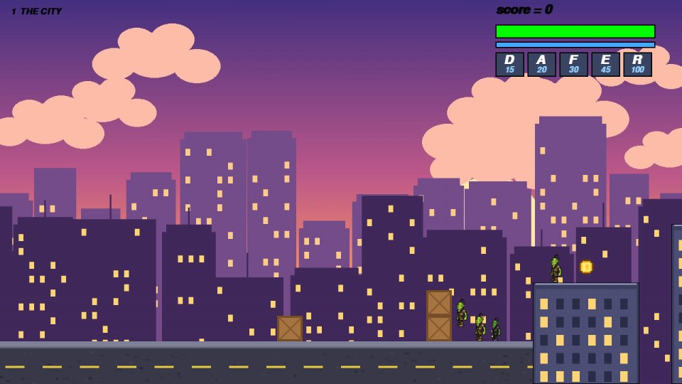 **1. The City**          | 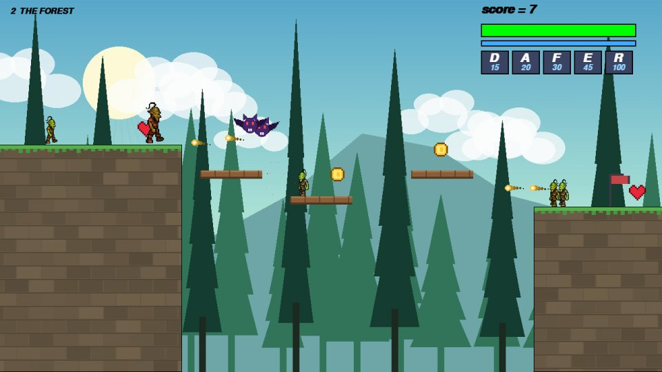 **2. The Forest** |
| 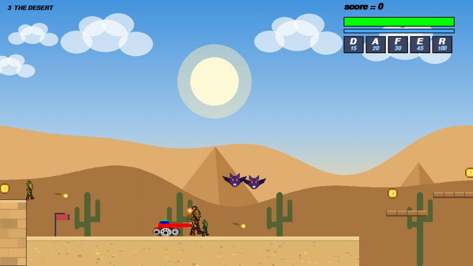 **3. The Desert**    | 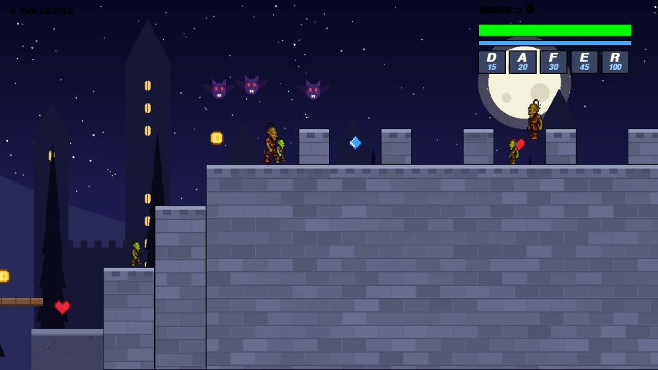 **4. The Castle** |
| 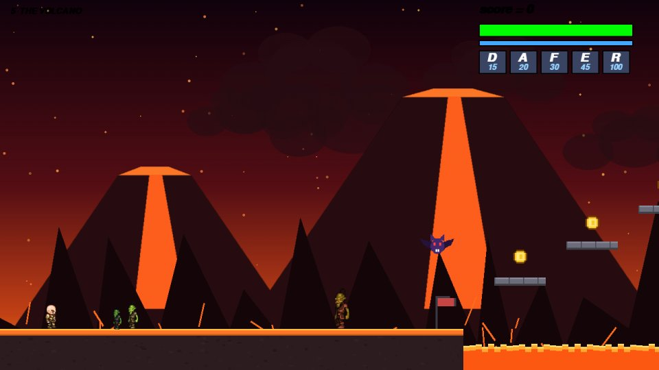 **5. The Volcano** | 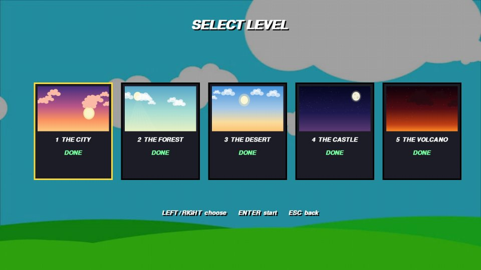 **Level Select**         |

Enemies include goblins, runners, brutes, archers, bats, and tanks.

Later levels introduce moving platforms, spikes, and lava pits, requiring abilities such as the double jump and dash to overcome some obstacles.

## Bosses

Each level ends with a unique boss battle.

Bosses have different attack patterns, including charges, ground slams, shockwaves, projectiles, falling fireballs, and summoned minions.

Each boss has three phases and becomes more aggressive as its health decreases.

|                                                              |                                                                  |
| ------------------------------------------------------------ | ---------------------------------------------------------------- |
| 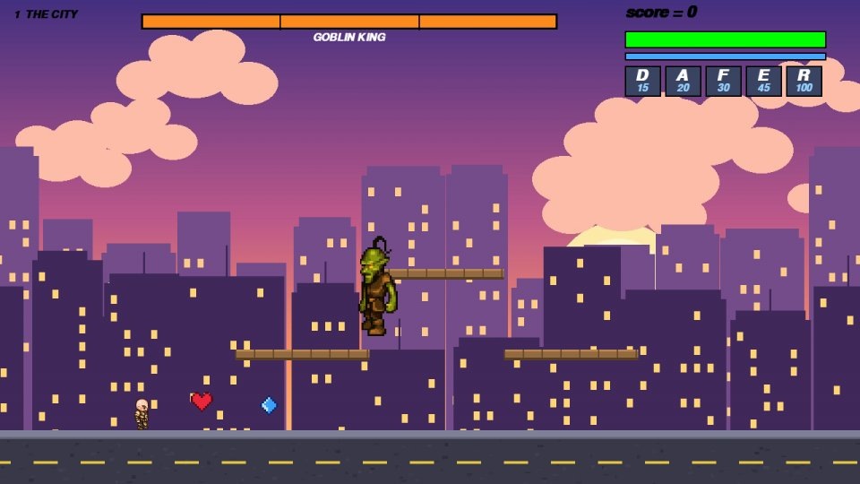 **Goblin King**   | 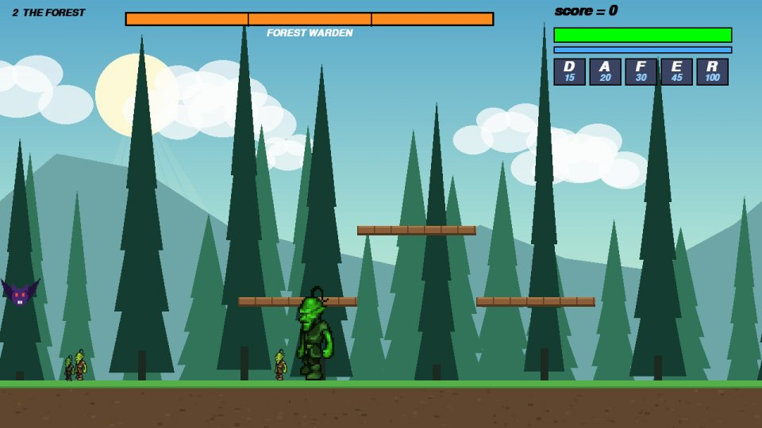 **Forest Warden** |
| 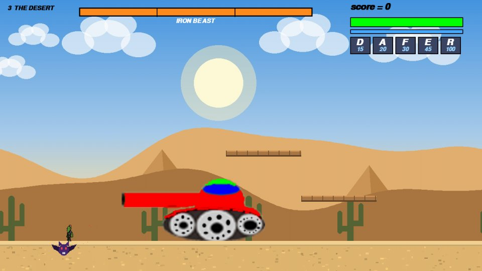 **Iron Beast**    | 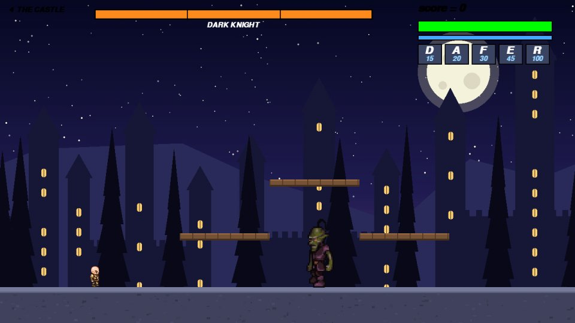 **Dark Knight**     |
| 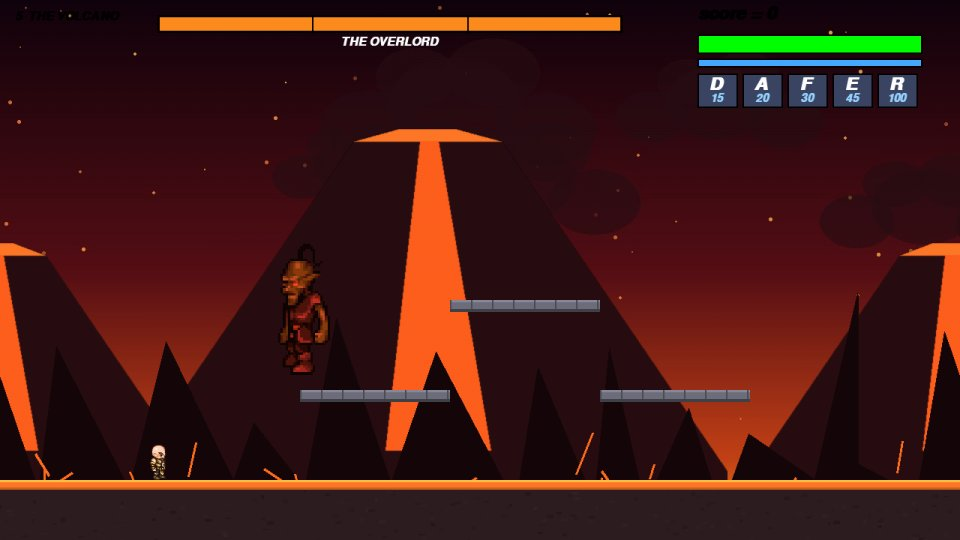 **The Overlord** |                                                                  |

When a boss fight starts, the camera locks onto the arena and a wall closes behind the player.

If the player dies, they return to the last checkpoint and the boss fight is reset.

## Survival Mode

Survival Mode takes place in a single arena with endless waves of enemies.

Each wave becomes more difficult, and a boss appears every five waves.

The game also keeps track of the best wave and best score.

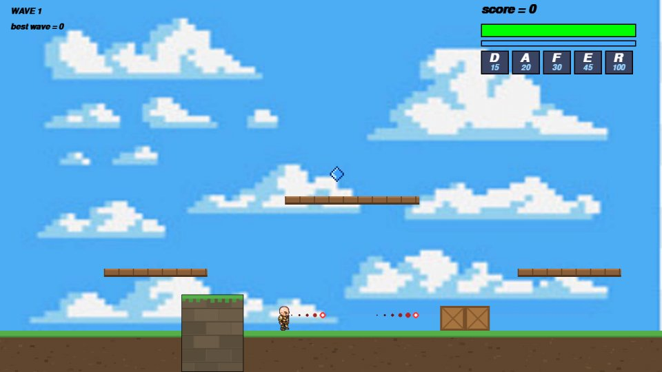

## Files

* `servaivle.py` — Main game loop, menus, camera, level loading, and Survival Mode
* `PLAYER.py`, `ENEMY.py`, `BOSS.py` — Characters and enemy systems
* `ABSOLUTE.py` — Base movement and collision system
* `SKILLS.py`, `BULLET.py`, `EFFECTS.py` — Abilities, projectiles, and visual effects
* `PLATFORM.py` — Platforms, hazards, pickups, and checkpoints
* `LEVELS.py` — Level data

Level configuration is handled in `LEVELS.py`.

Enemy statistics are defined in `ENEMY.py`, while boss statistics are defined in `BOSS.py`.

## Project Status

**In Progress 🚧**

The project is currently under development, with additional improvements and content planned.

## Technologies

* Python
* Pygame

## Notes

The game is currently keyboard-only.

If you encounter a bug or performance issues in later levels, feel free to open an issue and provide details about where the problem occurred.

## Author

**Jaafar Daoud**

Applied Communications Engineer

GitHub: [Jaafar-Daoud-AC](https://github.com/Jaafar-Daoud-AC)

